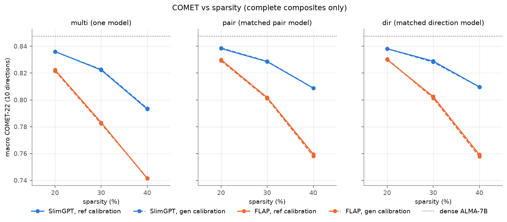
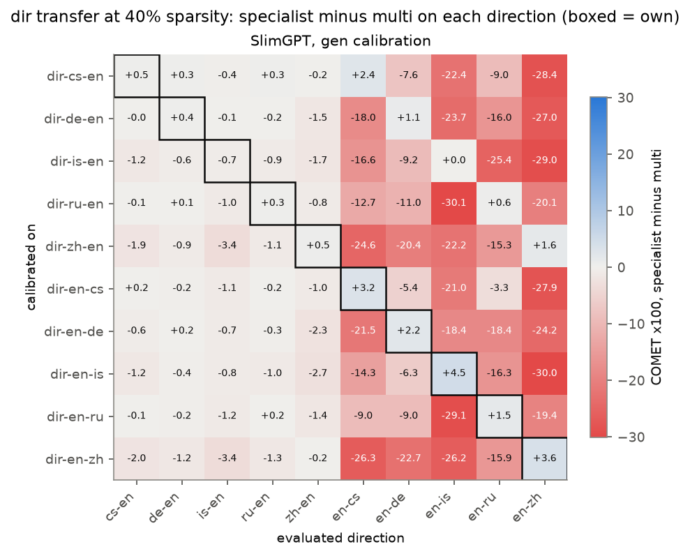
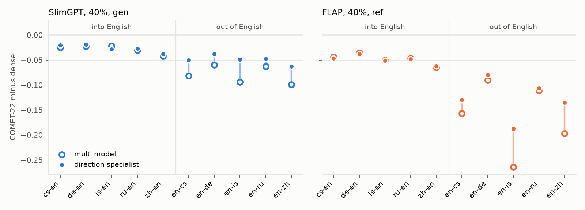
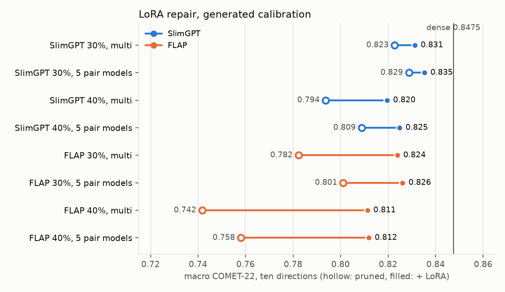

# Structured pruning of ALMA-7B: the full test-set evaluation

Run of 8 October 2026 on Snellius, branch `exp/final-grid`. Every system of the final
grid ([pilot report](../grid-2026-10-06/README.md)) re-evaluated on the complete test
sets, with MetricX-24 as a second learned metric, 17 additional LoRA repairs, and a
full-data transfer matrix. All tables with confidence intervals are in
[summary.md](summary.md).

## In short

- **The pilot was reliable.** Across the 36 headline cells, pilot and full test sets
  agree with Pearson r = 0.9995 and Spearman rho = 0.992; the mean difference is
  0.0013 COMET. Every pilot conclusion holds on the full data, and one gains
  precision: the small SlimGPT specialist gain at 20 percent, not significant on the
  pilot, is significant here.
- **SlimGPT beats FLAP everywhere:** +0.014 COMET at 20 percent, +0.039 at 30 and
  +0.052 at 40 for the multi model.
- **Specialised subnetworks beat one multi-directional subnetwork at every
  sparsity** (all 48 contrasts, COMET and MetricX, p < 0.001).
  - The gain is +0.002 to +0.003 COMET at 20 percent, which the pilot was too small
    to detect, and +0.015 to +0.019 at 30 and 40.
  - One subnetwork per pair is as good as one per direction.
- **Reference and self-generated calibration are equivalent.** Every COMET
  difference is within 0.0015 and none survives a multiple-comparison correction.
- **Subnetworks specialise by the language they write.** On the full data, a
  direction specialist at 40 percent loses 0.18 COMET on directions that produce
  another language, and keeps its quality reading into English.
- **LoRA repair recovers 26 to 49 percent of the loss for SlimGPT and 64 to 66
  percent for FLAP.** Specialisation still helps after repair for SlimGPT (+0.004 to
  +0.005 COMET) and for FLAP at 30 percent (+0.002), but not for FLAP at 40.
- **Best system at each level** (COMET; dense 0.8475):

  | removed | system | COMET |
  | --- | --- | --- |
  | 20% | SlimGPT multi + LoRA | 0.839 |
  | 30% | SlimGPT, 5 pair models + own-pair LoRA | 0.835 |
  | 40% | SlimGPT, 5 pair models + own-pair LoRA | 0.825 |

## 1. What was evaluated

| set | systems | evaluated on |
| --- | --- | --- |
| multi models | 12 (SlimGPT, FLAP x ref, gen x 20, 30, 40%) | all ten directions |
| pair and direction specialists | 180 | their own directions (two for a pair model, one for a direction model) |
| transfer matrix | the 10 SlimGPT gen 40% direction models, a subset of the 180 | all ten directions |
| LoRA repairs from the pilot run | 10 (5 multi, 5 SlimGPT gen 40% pair) | as their source |
| new LoRA repairs | 17 (FLAP gen 30 and 40% multi; pair models of SlimGPT gen 30%, FLAP gen 30% and 40%) | as their source |
| dense ALMA-7B | 1 | all ten directions |

**Test data:** the complete test sets used by ALMA: WMT22 for cs, de, ru and zh, and
WMT21 for Icelandic. That is 17,471 segments over the ten directions.

**Decoding and metrics:**
- greedy decoding, as in the pilot;
- BLEU, chrF++ and COMET-22 (primary);
- MetricX-24 hybrid large, one of the two WMT24 metrics task winners. It is an error
  score: lower is better.

**Significance:** a paired bootstrap stratified by direction, with 1,000 resamples.
Segments are resampled within each direction and the ten direction means averaged
with equal weight, so every reported difference equals the difference of the
macro-averaged scores.

**Why the complete table rather than a selection:** the pilot used the first 300
segments of these same test sets. Choosing winners on the pilot and reporting only
those on the full data would select on test data. Evaluating every configuration
avoids that; it costs little, because specialists translate only their own
directions.

**FLORES-200 was not used.** All 1,012 test sentences checked in de-en, is-en and
zh-en appear in ALMA's fine-tuning data, from which the calibration sets are also
drawn, so it is not a held-out test set for ALMA.

**Compute:** 58 GPU-hours, about 9,500 SBU, on A100 and H100 nodes of a busy cluster.

## 2. Main table

Macro COMET-22, BLEU in brackets. For pair and dir, each direction is translated by
its matching specialist. Dense ALMA-7B scores 0.8475 (30.32).

| method | calib | removed | multi | pair | dir |
| --- | --- | --- | --- | --- | --- |
| SlimGPT | ref | 20% | 0.8361 (27.76) | **0.8383** (28.21) | 0.8382 (28.10) |
| SlimGPT | gen | 20% | 0.8359 (27.91) | **0.8387** (28.27) | 0.8382 (28.19) |
| SlimGPT | ref | 30% | 0.8223 (25.78) | 0.8285 (26.60) | **0.8289** (26.57) |
| SlimGPT | gen | 30% | 0.8227 (25.94) | **0.8287** (26.78) | 0.8282 (26.81) |
| SlimGPT | ref | 40% | 0.7931 (23.24) | 0.8088 (24.04) | **0.8097** (24.23) |
| SlimGPT | gen | 40% | 0.7937 (23.27) | 0.8089 (24.33) | **0.8096** (24.44) |
| FLAP | ref | 20% | 0.8224 (26.74) | **0.8300** (27.49) | **0.8300** (27.70) |
| FLAP | gen | 20% | 0.8217 (26.72) | 0.8292 (27.44) | **0.8305** (27.73) |
| FLAP | ref | 30% | 0.7832 (23.61) | 0.8017 (24.50) | **0.8024** (24.48) |
| FLAP | gen | 30% | 0.7823 (23.55) | 0.8011 (24.46) | **0.8014** (24.52) |
| FLAP | ref | 40% | 0.7414 (20.31) | **0.7596** (20.31) | 0.7592 (20.45) |
| FLAP | gen | 40% | 0.7417 (20.17) | **0.7580** (20.34) | 0.7577 (20.54) |

MetricX-24, the same composites (lower is better). Dense ALMA-7B scores 2.937.

| method | calib | removed | multi | pair | dir |
| --- | --- | --- | --- | --- | --- |
| SlimGPT | ref | 20% | 3.356 | 3.287 | **3.265** |
| SlimGPT | gen | 20% | 3.345 | **3.258** | 3.274 |
| SlimGPT | ref | 30% | 3.809 | 3.608 | **3.562** |
| SlimGPT | gen | 30% | 3.815 | 3.614 | **3.578** |
| SlimGPT | ref | 40% | 4.857 | 4.324 | **4.246** |
| SlimGPT | gen | 40% | 4.866 | 4.303 | **4.278** |
| FLAP | ref | 20% | 3.851 | **3.604** | 3.605 |
| FLAP | gen | 20% | 3.884 | 3.640 | **3.593** |
| FLAP | ref | 30% | 5.222 | 4.612 | **4.591** |
| FLAP | gen | 30% | 5.231 | 4.641 | **4.604** |
| FLAP | ref | 40% | 6.697 | **6.154** | **6.154** |
| FLAP | gen | 40% | 6.665 | **6.175** | 6.179 |

Looping and truncation stay rare: at most 1.3 percent of a multi model's outputs hit
the 256-token budget (FLAP at 40 percent), against none for dense.

## 3. Findings

### 3.1 The pilot was a reliable proxy

The 36 headline composites (method x calibration x sparsity x scope) agree between
pilot and full test sets with Pearson r = 0.9995 and Spearman rho = 0.992. They
differ by 0.0013 COMET on average and 0.0044 at most. Every conclusion of the pilot
report holds. The full data adds precision: differences the pilot could not resolve
at 300 segments per direction are now measurable, notably the SlimGPT specialist gain
at 20 percent and the 20 percent repair.

### 3.2 SlimGPT against FLAP

SlimGPT minus FLAP in COMET (p < 0.001 everywhere):

| removed | multi | pair and dir |
| --- | --- | --- |
| 20% | +0.014 | +0.008 to +0.010 |
| 30% | +0.039 to +0.040 | +0.027 to +0.028 |
| 40% | +0.052 | +0.049 to +0.052 |

MetricX agrees. Specialisation narrows the gap at 20 and 30 percent, because it helps
FLAP more.

### 3.3 One subnetwork or one per language

Specialist minus multi, macro over the ten directions:

| | 20% | 30% | 40% |
| --- | --- | --- | --- |
| SlimGPT, COMET | +0.002 to +0.003 | +0.005 to +0.007 | +0.015 to +0.017 |
| FLAP, COMET | +0.008 to +0.009 | +0.019 | +0.016 to +0.018 |
| SlimGPT, MetricX | -0.07 to -0.09 | -0.20 to -0.25 | -0.53 to -0.61 |
| FLAP, MetricX | -0.24 to -0.29 | -0.59 to -0.63 | -0.49 to -0.54 |

- All 48 contrasts (2 methods x 2 calibration texts x 3 sparsities x pair or dir x 2
  metrics) favour the specialists, at p < 0.001.
- The SlimGPT gain at 20 percent was not significant on the pilot. With the full
  data it is small but clear.
- Pair and direction subnetworks are equivalent. Five pair models cover all ten
  directions, as well as ten direction models do.

### 3.4 Reference or generated calibration text

- **No practical difference.** Every COMET difference is within 0.0015.
- **Nominal significance only:**
  - COMET: 3 of 18 contrasts reach p < 0.05 (smallest p = 0.034).
  - MetricX: 3 of 18 reach p < 0.05, in mixed directions.
  - With 18 contrasts per metric, none survives a Holm correction, which needs p < 0.0028.
- **Small consistent pattern:** FLAP favours the reference text in 7 of 9 COMET
  contrasts, by 0.0007 on average. SlimGPT shows no tendency (mean +0.0001).
- **Practical consequence, unchanged from the pilot:** pruning a translation model can
  be calibrated on source sentences and the dense model's own translations, with no
  parallel data.

### 3.5 What specialises: transfer on the full data

The ten SlimGPT gen 40% direction models were evaluated on all ten directions.

COMET change against multi, mean over the cells of each kind (pilot in brackets):

| evaluated on | change |
| --- | --- |
| own direction | +0.016 (+0.018) |
| its reverse | +0.005 (+0.006) |
| other directions into the same target | -0.008 (-0.006) |
| directions writing a different language | -0.182 (-0.178) |

- The full-data matrix reproduces the pilot's.
- A specialist keeps its quality wherever it writes English or its own pair's
  language, and loses it when it must write another language.
- Structurally, the two direction subnetworks of one language overlap most: FFN
  Jaccard 0.84 to 0.87, against 0.63 to 0.77 for any other two
  ([pilot overlap analysis](../grid-2026-10-06/overlap.md)).

### 3.6 Directions and resource level

Mean COMET change against dense at 40 percent, multi models:

| model | into English | out of English | worst |
| --- | --- | --- | --- |
| SlimGPT gen | -0.028 | -0.079 | en-zh -0.099 |
| FLAP ref | -0.048 | -0.164 | en-is -0.264 |

- Generating Icelandic (low resource) and Chinese (distant) suffers most.
- The en-is direction specialist recovers +0.045 (SlimGPT) and +0.077 (FLAP) over
  multi on en-is.

### 3.7 LoRA repair

ALMA's LoRA recipe, one epoch. A multi model trains on all ten directions (914
steps); a pair model only on its own pair.

| repaired multi model | COMET pruned -> repaired (dense 0.8475) | recovered | MetricX pruned -> repaired (dense 2.937) | recovered | BLEU pruned -> repaired |
| --- | --- | --- | --- | --- | --- |
| SlimGPT 20% ref | 0.8361 -> 0.8391 | 26% | 3.356 -> 3.234 | 29% | 27.76 -> 28.51 |
| SlimGPT 30% gen | 0.8227 -> 0.8312 | 34% | 3.815 -> 3.474 | 39% | 25.94 -> 27.48 |
| SlimGPT 40% ref | 0.7931 -> 0.8195 | 48% | 4.857 -> 3.916 | 49% | 23.24 -> 26.10 |
| SlimGPT 40% gen | 0.7937 -> 0.8196 | 48% | 4.866 -> 3.915 | 49% | 23.27 -> 26.16 |
| FLAP 30% gen | 0.7823 -> 0.8239 | 64% | 5.231 -> 3.831 | 61% | 23.55 -> 27.05 |
| FLAP 40% ref | 0.7414 -> 0.8111 | 66% | 6.697 -> 4.216 | 66% | 20.31 -> 25.72 |
| FLAP 40% gen | 0.7417 -> 0.8113 | 66% | 6.665 -> 4.252 | 65% | 20.17 -> 25.91 |

Every multi repair improves COMET and MetricX at p < 0.001, including the 20 percent
one, which was not significant on the pilot. All 20 pair repairs improve COMET
(p <= 0.002) and MetricX (p <= 0.016). The SlimGPT 30 percent Icelandic pair repair is
the one case where BLEU falls (26.03 to 25.47) while COMET and MetricX improve; it
trained for 28 steps on 3,500 segments. Repair recovers more the more was lost, so the
methods converge. FLAP at 40 percent ends 0.008 COMET below SlimGPT, against 0.052
before repair.

**Does specialisation still pay after repair?** The five pair models, each repaired on
its own pair, against the multi model repaired on all ten directions; generated
calibration ([composite_contrasts.md](composite_contrasts.md)):

| method | removed | multi + LoRA | pair + LoRA | pair minus multi, COMET | pair minus multi, MetricX |
| --- | --- | --- | --- | --- | --- |
| SlimGPT | 30% | 0.8312 | **0.8353** | +0.0041 [+0.0031, +0.0051] | -0.103 (p < 0.001) |
| SlimGPT | 40% | 0.8196 | **0.8248** | +0.0052 [+0.0041, +0.0064] | -0.132 (p < 0.001) |
| FLAP | 30% | 0.8239 | **0.8261** | +0.0022 [+0.0010, +0.0034] | -0.073 (p = 0.003) |
| FLAP | 40% | 0.8113 | 0.8118 | +0.0006 [-0.0008, +0.0020], n.s. | +0.037 (n.s.) |

- Repair removes most of the specialisation gain (generated calibration, COMET):

  | | 30%, before repair | 30%, after | 40%, before repair | 40%, after |
  | --- | --- | --- | --- | --- |
  | SlimGPT | +0.006 | +0.004 | +0.015 | +0.005 |
  | FLAP | +0.019 | +0.002 | +0.016 | +0.001 (n.s.) |

- Specialists still win for SlimGPT, and for FLAP at 30 percent.
- The comparison favours the multi repair in one respect: it trains on all of ALMA's
  data, about five times what each pair model sees.

## 4. Best systems

| removed | system | COMET | MetricX | BLEU |
| --- | --- | --- | --- | --- |
| 0% | dense ALMA-7B | 0.8475 | 2.937 | 30.32 |
| 20% | SlimGPT ref, multi + LoRA | 0.8391 | 3.234 | 28.51 |
| 20% | SlimGPT gen, 5 pair models (no repair) | 0.8387 | 3.258 | 28.27 |
| 30% | SlimGPT gen, 5 pair models + own-pair LoRA | 0.8353 | 3.371 | 28.04 |
| 40% | SlimGPT gen, 5 pair models + own-pair LoRA | 0.8248 | 3.783 | 26.34 |

- At 20 percent one repaired model, or five unrepaired specialists, keeps 99 percent
  of dense COMET.
- At 40 percent five repaired pair models keep 97 percent, with each model 61.6
  percent of the dense parameter count.
- Pair models with own-pair repair at 20 percent were not run.

## 5. Caveats

- **Greedy decoding throughout.** Scores are not comparable with ALMA's published
  beam-5 numbers.
- **One calibration seed.** The pilot replicate with a second seed showed composite
  noise of up to 0.004 COMET. That is below every effect reported here except the
  20 percent SlimGPT specialist gain and the reference-versus-generated differences.
- **Mixed hardware.** Models ran on A100 and H100 nodes. Greedy decoding on different
  GPUs can differ in rare tie-breaks; there is no systematic effect.
- **Not measured:** throughput. Pruning reduces memory and parameters (19.3, 28.8 and
  38.4 percent of all parameters); earlier benchmarks found no speedup under eager
  Hugging Face generation.

## 6. Files

| path | content |
| --- | --- |
| [summary.md](summary.md) | every table: COMET and MetricX headlines with CIs, ref vs gen, method contrasts, per-direction, sparsity curves, transfer, behaviour, repair, structure |
| [composite_contrasts.md](composite_contrasts.md) | specialisation after repair; pilot against full suite |
| [repair.md](repair.md) | repairs on each model's own directions |
| [long.csv](long.csv), [results.json](results.json) | all numbers, machine-readable |
| [plots/](plots/) | figures |
| [runs/](runs/) | manifests and scores of all 220 runs, including per-segment COMET and MetricX |

**Scripts and job files:**
- `scripts/grid_report.py`: tables and contrasts.
- `scripts/repair_summary.py`, `scripts/composite_contrasts.py`, `scripts/grid_figures.py`.
- `slurm/submit_eval.sh` and `slurm/eval_directions.sbatch`: full-suite evaluation as A100/H100 twins.
- `slurm/score_metricx.sbatch`: MetricX in batches.

Hypotheses and checkpoints stay on the scur0560 account (`runs/`,
`/scratch-shared/scur0560/checkpoints/`).
