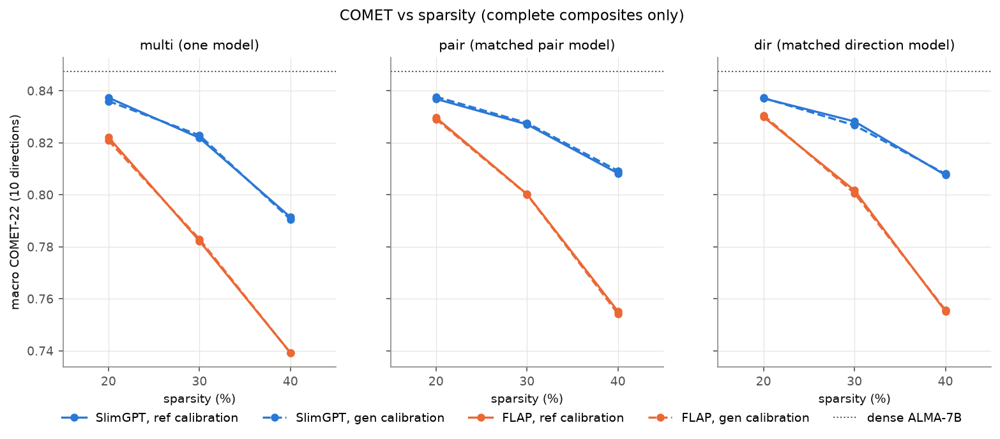
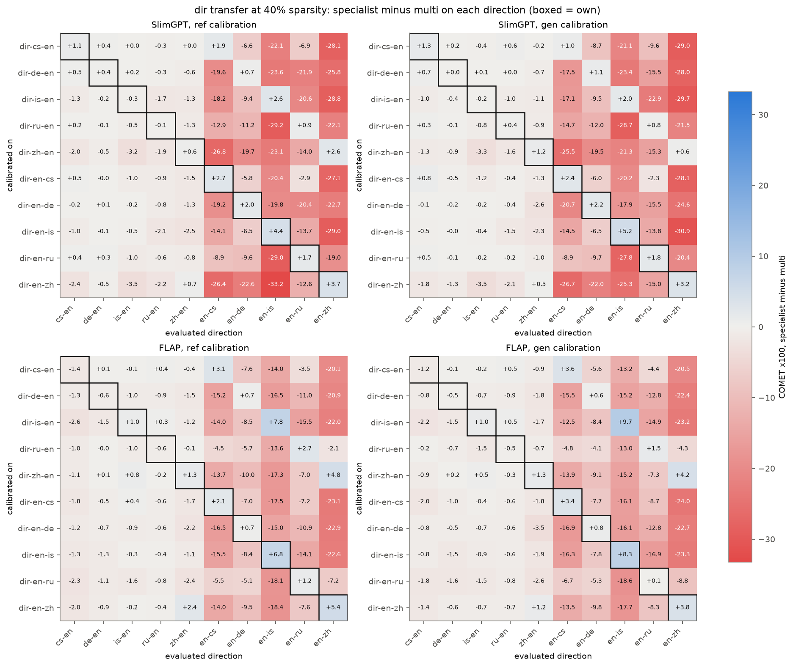
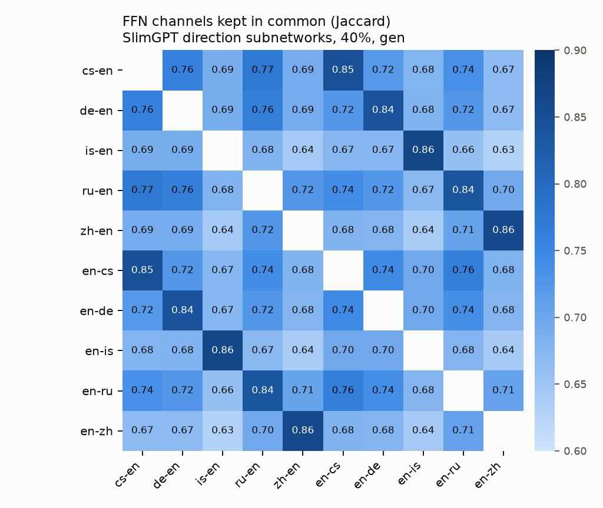
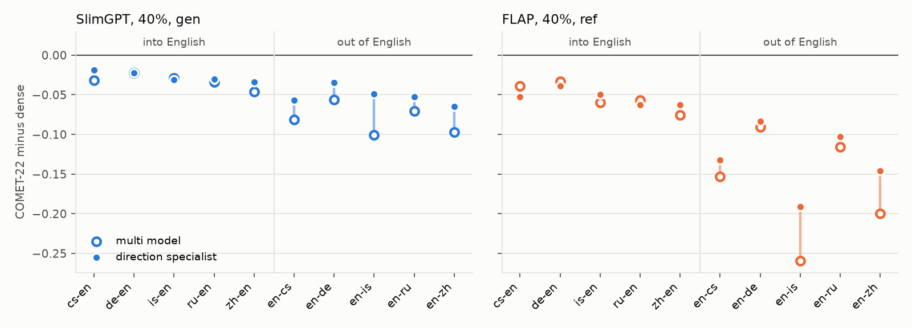
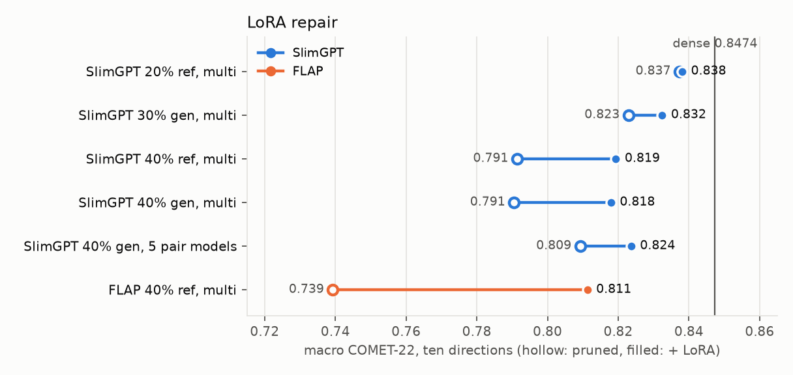

# Structured pruning of ALMA-7B: the final pilot grid

Run of 6 October 2026 on Snellius, branch `exp/final-grid`. This page is the report;
the chronological log, every decision taken during the night and the job ids are in
[docs/overnight-2026-10-06.md](../../docs/overnight-2026-10-06.md), and every table
with confidence intervals is in [summary.md](summary.md).

## In short

- **SlimGPT beats FLAP at every setting.** The gap is 0.015 COMET at 20 percent and
  0.05 at 40, significant in all 18 contrasts.
- **Reference and self-generated calibration are indistinguishable.** All 18
  contrasts are within ±0.0015 COMET and none is significant. Calibration therefore
  needs only source sentences: ALMA-7B's own greedy translation serves as well as a
  human reference.
- **From 30 percent up, specialised subnetworks beat one multi-directional
  subnetwork at equal calibration size** (+0.017 COMET at 40 percent).
  - One subnetwork per language pair is as good as one per direction.
  - A second calibration draw reproduces this.
- **Subnetworks specialise by the non-English language, not by direction.**
  - Behaviour: a specialist transfers to any direction that reads into English and to
    its own pair's reverse, but collapses when it has to write another language.
  - Structure: the two direction subnetworks of one language share far more units
    than any other two.
- **Out-of-English Icelandic and Chinese degrade most.** They also gain most from
  specialisation.
- **LoRA repair recovers about half of the 40 percent loss for SlimGPT and two thirds
  for FLAP.** The best 40 percent system is five pair subnetworks, each repaired on
  its own pair (COMET 0.824 against 0.847 dense).

## 1. What was run

| factor | levels |
| --- | --- |
| model | `haoranxu/ALMA-7B` (Llama-2-7B, fully fine-tuned for translation) |
| method | SlimGPT with the paper's log-increase layer schedule; FLAP with its own adaptive structure search (AL-AM) |
| calibration text | prompt + reference translation (`ref`); prompt + dense ALMA-7B greedy translation (`gen`) |
| removed | 20, 30, 40 percent of attention and MLP weights |
| scope | one multi-directional subnetwork; five pair subnetworks (cs, de, is, ru, zh, both directions each); ten direction subnetworks |

**Grid:** 2 x 2 x 3 x 16 = 192 pruned models.

**Calibration:**
- Every model is calibrated on 1,280 segments of ALMA's human-written parallel data, never the test set: 128 per direction for multi, 640 for pair, 1,280 for direction.
- The `ref` and `gen` arms use the same source sentences. Both end with the end-of-sequence token.

**Evaluation:**
- The pilot suite: the first 300 segments of each of the ten WMT22 directions (WMT21 for Icelandic), greedy decoding, BLEU, chrF++ and COMET-22.
- Every model, specialists included, is evaluated on all ten directions, which gives the transfer matrices.
- A specialist's headline score uses each specialist on its own direction(s).
- Significance is a paired bootstrap over segments (1,000 resamples).

**Additionally:**
- LoRA repair of ten models, with ALMA's own recipe (rank 16, one epoch on ALMA-Human-Parallel minus the two segments that collide with WMT22).
- A second calibration draw for the 48 SlimGPT `ref` models.
- A FLAP budget ablation.
- The dense model on the full test sets.

**Compute and failures:** 78 GPU-hours (A100 and H100), about 11,400 SBU. No grid job failed.

## 2. Main results

COMET-22, BLEU in brackets, macro over the ten directions. Dense ALMA-7B scores 0.8474 (30.35).

| method | calib | removed | multi | pair | dir |
| --- | --- | --- | --- | --- | --- |
| SlimGPT | ref | 20% | **0.8374** (27.72) | 0.8369 (27.97) | 0.8371 (27.95) |
| SlimGPT | gen | 20% | 0.8360 (27.52) | **0.8377** (28.13) | 0.8373 (27.93) |
| SlimGPT | ref | 30% | 0.8219 (25.54) | 0.8271 (26.27) | **0.8282** (26.43) |
| SlimGPT | gen | 30% | 0.8229 (25.88) | **0.8276** (26.52) | 0.8267 (26.58) |
| SlimGPT | ref | 40% | 0.7914 (23.13) | **0.8083** (23.99) | 0.8076 (24.13) |
| SlimGPT | gen | 40% | 0.7905 (22.92) | **0.8092** (24.18) | 0.8081 (24.44) |
| FLAP | ref | 20% | 0.8221 (26.81) | 0.8297 (27.24) | **0.8299** (27.67) |
| FLAP | gen | 20% | 0.8209 (26.70) | 0.8291 (27.31) | **0.8306** (27.70) |
| FLAP | ref | 30% | 0.7823 (23.66) | 0.8003 (24.09) | **0.8017** (24.49) |
| FLAP | gen | 30% | 0.7830 (23.97) | 0.8001 (24.39) | **0.8006** (24.59) |
| FLAP | ref | 40% | 0.7393 (20.50) | 0.7552 (20.11) | **0.7552** (20.33) |
| FLAP | gen | 40% | 0.7392 (20.12) | 0.7543 (19.95) | **0.7557** (20.46) |

Of the whole model including embeddings, the three levels remove 19.2 to 19.3, 28.8
and 38.4 percent of the parameters, the same for both methods. Neither method loops or
truncates much. Averaged over directions, at most 1.3 percent of a multi model's
outputs hit the 256-token budget (FLAP at 40 percent; at most 4.7 percent in a single
direction), against none for dense.



## 3. Findings

### 3.1 SlimGPT against FLAP

SlimGPT minus FLAP, multi scope, with reference calibration:

| removed | COMET | BLEU |
| --- | --- | --- |
| 20% | +0.015 | +0.9 |
| 30% | +0.040 | +1.9 |
| 40% | +0.052 | +2.6 |

- The gap holds for every calibration text and scope (COMET, p < 0.001).
- SlimGPT refits the surviving weights to the calibration activations, while FLAP only
  adds back the mean of what it removed. That difference grows with what is removed.
- The two remove the same parameters in different shapes:
  - SlimGPT takes the same share of heads and FFN channels in every layer.
  - FLAP's AL-AM removes 2 to 3 percent of heads and 29 percent of channels at 20
    percent, and about 27 and 46 percent at 40.

### 3.2 One multi-directional subnetwork or several specialised ones

At equal calibration size, a subnetwork calibrated on one pair or one direction
translates its own directions better than the multi-directional one once enough is
removed. Gain over multi in macro COMET:

| | 20% | 30% | 40% |
| --- | --- | --- | --- |
| SlimGPT, pair | -0.001 to +0.002 (n.s.) | +0.005 | +0.017 to +0.019 |
| SlimGPT, dir | -0.000 to +0.001 (n.s.) | +0.004 to +0.006 | +0.016 to +0.018 |
| FLAP, pair | +0.008 | +0.017 to +0.018 | +0.015 to +0.016 |
| FLAP, dir | +0.008 to +0.010 | +0.018 to +0.019 | +0.016 to +0.017 |

- Pair and direction subnetworks are statistically the same, so five pair models are
  enough.
- This reverses the 29 September pilot. There, pair subnetworks lost to multi
  everywhere, but they had 256 calibration segments against multi's 1,280. SlimGPT
  fits a weight update to the calibration Hessian, and that size difference was the
  larger effect.

**Robustness to the calibration draw.** All 48 SlimGPT `ref` models were rebuilt on
calibration sets drawn with another seed (5678 instead of 1234).

| SlimGPT ref | multi | pair | dir |
| --- | --- | --- | --- |
| 20%, seed 1234 / 5678 | 0.8374 / 0.8360 | 0.8369 / 0.8380 | 0.8371 / 0.8363 |
| 30%, seed 1234 / 5678 | 0.8219 / 0.8223 | 0.8271 / 0.8268 | 0.8282 / 0.8282 |
| 40%, seed 1234 / 5678 | 0.7914 / 0.7954 | 0.8083 / 0.8067 | 0.8076 / 0.8094 |

- Scores move by at most 0.004 between draws.
- The specialist gain at 30 and 40 percent is significant under both draws.
- The selected units barely change: FFN-channel Jaccard 0.92 to 0.98 between draws,
  against 0.63 to 0.87 between different directions ([overlap.md](overlap.md)).
- Full replicate report: [seed2/summary.md](seed2/summary.md).

### 3.3 Reference or generated calibration text

Replacing the reference with the dense model's own greedy translation changes nothing:
every delta is within ±0.0015 COMET and none is significant. The two texts are not
the same: ALMA-7B's translations of the calibration sources score chrF++ 49 to 67
against the references (30 for en-zh, where chrF counts characters), with at most 3
percent exact matches ([calibration_diagnostics.md](calibration_diagnostics.md)).

What the criteria need is target-language text in the model's input. The 29 September
pilot found that calibrating on the prompt alone costs far more: BLEU 20.65 against
28.33 with the reference, at 20 percent and with the old SlimGPT code. Whether that
text is human or self-generated does not matter, so a pruned translation model can be
calibrated from monolingual source text alone.

### 3.4 What a specialised subnetwork specialises in

Every specialist is evaluated on all ten directions. The heatmaps show, for each
direction subnetwork, its COMET minus the multi model's on every direction (boxed:
its own).



Direction models at 40 percent, mean COMET change against multi:

| evaluated on | SlimGPT | FLAP |
| --- | --- | --- |
| its own direction | +0.017 | +0.016 |
| its reverse (same language pair) | +0.006 to +0.009 | +0.016 to +0.018 |
| other directions into the same target language | -0.006 | -0.006 |
| directions writing a different language | -0.18 | -0.13 to -0.14 |

**Behaviour:**
- Every specialist is nearly harmless on directions into English.
- Every specialist breaks when it has to produce a language it was not calibrated on.
  The en-is and en-zh columns are the extreme.
- A specialist works for both directions of its own pair. dir-is-en, for instance,
  also improves en-is.

**Structure** says the same: subnetworks group by the non-English language.



- The two direction subnetworks of one language share 0.84 to 0.87 of their FFN
  channels. Any two others share 0.63 to 0.77.
- Czech and Russian are the closest pair of languages: en-cs and en-ru share 0.76 of
  their channels (Jaccard), and the en-cs specialist loses only 0.02 to 0.03 COMET on
  en-ru.
- Icelandic and Chinese are the most distinct.
- FLAP shows the same pattern ([overlap.md](overlap.md)).

### 3.5 Directions and resource level



Mean COMET change against dense at 40 percent, multi models:

| model | into English | out of English | worst |
| --- | --- | --- | --- |
| SlimGPT gen | -0.033 | -0.081 | en-is -0.101 |
| FLAP ref | -0.053 | -0.164 | en-is -0.259 |

- Generating the low-resource language (Icelandic, about 2,000 training pairs) and
  the most distant one (Chinese) is what pruning damages most.
- The direction specialist recovers most exactly there: en-is gains +0.05 for SlimGPT
  and +0.07 for FLAP over multi.
- At 20 percent the same ordering holds at a smaller scale. SlimGPT ref: -0.007 into
  English, -0.013 out of it.

Per-direction tables for every multi model are in [summary.md](summary.md), section
"Per-direction scores".

### 3.6 LoRA repair



| repaired model | COMET before -> after (dense 0.8474) | gap recovered | BLEU before -> after |
| --- | --- | --- | --- |
| SlimGPT 20% ref, multi | 0.8374 -> 0.8381 (n.s.) | 7% | 27.72 -> 28.41 |
| SlimGPT 30% gen, multi | 0.8229 -> 0.8324 | 39% | 25.88 -> 27.59 |
| SlimGPT 40% ref, multi | 0.7914 -> 0.8193 | 50% | 23.13 -> 26.13 |
| SlimGPT 40% gen, multi | 0.7905 -> 0.8179 | 48% | 22.92 -> 26.36 |
| SlimGPT 40% gen, 5 pair models, each repaired on its own pair | 0.8092 -> 0.8236 | 38% | 24.18 -> 26.08 |
| FLAP 40% ref, multi | 0.7393 -> 0.8112 | 67% | 20.50 -> 25.73 |

- **Recipe:** ALMA's own LoRA stage, one epoch over its human-written parallel data,
  914 optimizer steps of 128 sequences for a multi model. That takes 1 h 40 to 2 h
  on one A100.
- **Pair repairs** train only on their own pair: 28 steps for Icelandic, up to 237 for
  Chinese.
- Held-out loss fell for every repair.
- **Gains grow with sparsity, and the weaker method gains more.** FLAP closes from
  0.052 behind SlimGPT to 0.008 behind.
- **The best 40 percent system** is the five pair subnetworks with own-pair LoRA: 0.824.
  - It beats the repaired multi model (0.818).
  - It comes close to the unrepaired 30 percent pair models (0.828).
- Own-pair results per pair: [repair.md](repair.md).

**Added on 8 October.** 17 more repairs complete the comparison for generated
calibration: FLAP 30 and 40 percent multi, and the pair models of SlimGPT 30 percent
and FLAP 30 and 40 percent, each on its own pair. Their pilot scores are in
[repair.md](repair.md) and [plots/repair_grid.png](plots/repair_grid.png). After repair
the specialist gain mostly disappears. The full-suite analysis is in
[../full-2026-10-08/README.md](../full-2026-10-08/README.md), section 3.7.

### 3.7 FLAP needs its own budget

FLAP's adaptive structure search (AL-AM) was compared with a simpler budget that
ranks heads and FFN channels separately across layers (`global`), multi scope:

| FLAP budget | 20% | 30% | 40% |
| --- | --- | --- | --- |
| AL-AM, ref / gen | 0.822 / 0.821 | 0.782 / 0.783 | 0.739 / 0.739 |
| separate `global`, ref / gen | 0.832 / 0.831 | 0.428 / 0.425 | 0.568 / 0.590 |

- The separate budget is better at 20 percent but collapses beyond it: 55 percent of
  outputs loop to the token budget at 30.
- A uniform budget, which also cuts the first and last layers, collapsed already at
  20 percent in the direction-scope experiment of 5 October.
- So the grid uses AL-AM, which is also the FLAP paper's best and its code's default.

### 3.8 The SlimGPT fix

The repository's SlimGPT used SparseGPT's column-order sweep. A removed column was
compensated only by the columns after it, so the last heads of each layer got no
compensation at all, and late units looked more important than early ones. It was
replaced before the grid ran by the paper's method:
- the exact joint least-squares refit of all surviving columns;
- greedy removal with re-scoring;
- attention pruned before the FFN.

On the same setting (20 percent, multi, ref, log-increase) the old code scores 0.8354
(27.31) and the fixed one 0.8374 (27.72). Earlier numbers in the repository (the 29
September pilot, the layer-protection and direction-scope experiments) used the old
code.

An independent reimplementation agrees with the new code to within 2e-5 on the
weights, with identical selections. It refits by direct least squares from a full
forward pass.

## 4. For the full evaluation

Done on 8 October 2026, for the complete table rather than a selection:
[../full-2026-10-08/README.md](../full-2026-10-08/README.md).

The pilot ranks the options; the full test sets decide the final numbers. Candidates:

1. **SlimGPT 20% ref, multi:** the best single model at 20 percent, where
   specialists add nothing.
2. **SlimGPT 40% gen, multi + LoRA:** the repaired single model at the highest
   sparsity.
3. **SlimGPT 40% gen, five pair models + own-pair LoRA:** the best 40 percent system.
4. **Optional:**
   - SlimGPT 30% gen, multi + LoRA, for the middle of the curve;
   - FLAP 40% ref, multi + LoRA, as the method contrast after repair.

`ref` against `gen` does not matter. Pick one and state it; `gen` needs no references.

```bash
bash slurm/submit_eval.sh alma-7b-slimgpt20-ref-multi alma-7b-slimgpt40-gen-multi-lora \
    alma-7b-slimgpt40-gen-pair-{cs,de,is,ru,zh}-lora
```

The command submits one A100 job per system on `configs/suites/alma10-greedy.yaml`.
Pair and direction models are evaluated on their own directions only. Two
prerequisites already ran ([../full-2026-10-06/](../full-2026-10-06/README.md)):
- dense ALMA-7B on the full test sets: COMET 0.8475, BLEU 30.32, in 34 minutes;
- the Icelandic pair model with LoRA on the full en-is and is-en sets.

## 5. Caveats

- **Pilot suite:** 300 segments per direction, the first of each test set (ordered by
  document), so absolute scores are not WMT-comparable. Comparisons between systems
  are fair, since every system sees the same segments.
- **One calibration seed for most of the grid:** the SlimGPT `ref` replicate shows
  draw noise of up to 0.004 COMET. For Icelandic the two draws share 63 percent of
  their sources, because only 2,009 pairs exist.
- **Mixed GPUs:** models ran on A100 and H100. Each run's status file records which.
- **Throughput:** not measured. Earlier benchmarks found no speedup from pruning under
  eager Hugging Face generation, only lower memory.
- **COMET-22 is the primary metric:** BLEU and chrF++ agree in direction almost
  everywhere. The exception is FLAP at 40 percent, where specialists gain COMET but
  not BLEU.

## 6. Files

| path | content |
| --- | --- |
| [summary.md](summary.md) | every table: headline with CIs, ref vs gen, method contrasts, per-direction, sparsity curves, transfer, behaviour, repair, structure |
| [long.csv](long.csv) | one row per system and direction, all metrics and behaviour rates |
| [results.json](results.json) | the headline numbers, machine-readable |
| [transfer/](transfer/) | full 5 x 10 and 10 x 10 transfer matrices per configuration |
| [overlap.md](overlap.md) | subnetwork overlap matrices and seed stability |
| [repair.md](repair.md) | repairs on each model's own directions |
| [calibration_diagnostics.md](calibration_diagnostics.md) | generated calibration against references |
| [seed2/](seed2/summary.md) | the seed-5678 replicate |
| [plots/](plots/) | all figures |
| [runs/](runs/README.md) | per-run manifests and scores, including per-segment COMET |
| `subnetworks.npz` | keep masks of all 240 subnetworks (below) |

```python
import numpy as np
masks = np.load("results/grid-2026-10-06/subnetworks.npz")
heads = masks["alma-7b-slimgpt40-gen-pair-de/heads"]  # bool (32 layers, 32 heads)
ffn = masks["alma-7b-slimgpt40-gen-pair-de/ffn"]      # bool (32 layers, 11008 channels)
```

**Code:**
- `src/mnlp_eval/prune/` holds the criteria.
- Grid tooling: `scripts/grid.py` and `slurm/grid_pipeline.sbatch` (configs and jobs);
  `scripts/grid_report.py`, `repair_summary.py`, `grid_overlap.py`, `grid_figures.py`
  and `calibration_diagnostics.py` (this report).
- Method notes: [docs/pruning.md](../../docs/pruning.md).

**Not in git:**
- Hypotheses (710 MB) are in `runs/` on the scur0560 account.
- Pruned and repaired checkpoints (2.4 TB) are in
  `/scratch-shared/scur0560/checkpoints/` until about 20 October 2026.
- The generated model configs under `configs/models/` point there.
